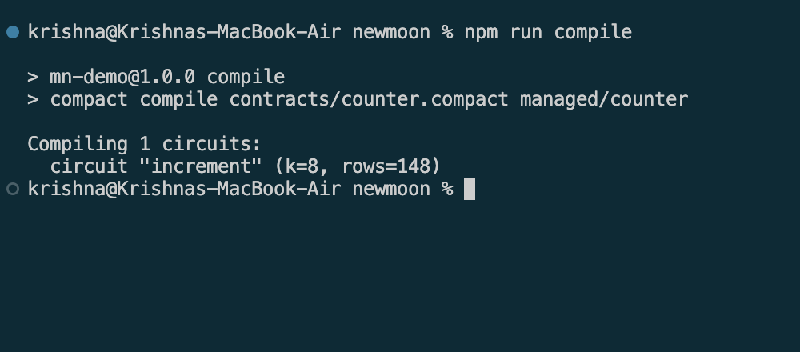
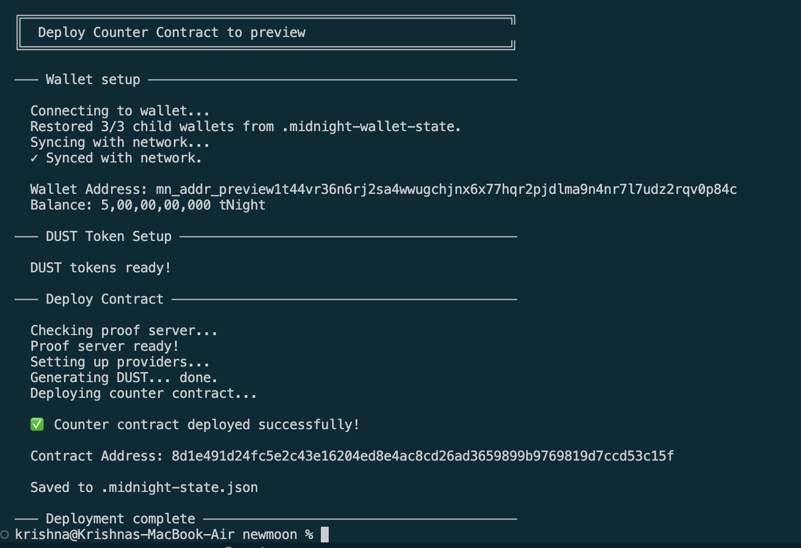

# WhistleScore
> A privacy-preserving workplace safety & hazard counter built on Midnight using zero-knowledge proofs.

## Contract Address
| Network  | Address                          |
|----------|----------------------------------|
| Preview  | 8d1e491d24fc5e2c43e16204ed8e4ac8cd26ad3659899b9769819d7ccd53c15f |
| Preprod  | [PASTE ADDRESS AFTER DEPLOY]     |

## What This Does
This contract maintains a public counter on the Midnight blockchain. Users can increment the counter by a specific step amount, provided they can prove they know the correct secret authorization token. The step amount added is disclosed publicly, but the secret token is kept entirely private and never leaves the user's local machine.

## Privacy Model
- What is PUBLIC (on-chain, visible to anyone): The `counter` state variable and the `step` amount during each increment transaction.
- What is PRIVATE (private witness, never on-chain): The `secret_token` parameter passed into the `increment` circuit.
- What the user PROVES without revealing: The user proves they know the correct `secret_token` (which must equal 42) to authorize the increment action, without revealing the token itself.

## Tech Stack
- Midnight network, Compact language, Node.js v22, Docker

## Prerequisites
- **Node.js**: v22
- **Docker**: For running the Midnight proof server
- **Compact Compiler**: v0.31.1 or compatible (`curl --proto '=https' --tlsv1.2 -LsSf https://github.com/midnightntwrk/compact/releases/latest/download/compact-installer.sh | sh`)

## Setup
1. Clone the repository and navigate into the project root:
   ```bash
   cd my-project
   ```
2. Install the necessary testing and runtime dependencies:
   ```bash
   npm install
   ```
3. Compile the Compact contract to generate the local `managed` artifacts:
   ```bash
   compact compile contracts/counter.compact managed/counter
   ```

## Run Tests
Run the test suite to verify the circuit logic, state transitions, and privacy preservation:
```bash
npx vitest run tests/counter.test.ts
```

## Initial Idea
In high-risk industries (aviation, manufacturing, healthcare), workers often hesitate to report safety violations due to fear of employer retaliation. WhistleScore allows verified employees to submit incident severity points to a public company safety score using a private employee voucher witness. Regulators and the public get transparent, immutable accountability while the whistleblower's identity remains completely protected by zero-knowledge proofs.

## Screenshots
### Contract Compilation


### Contract Deployment


